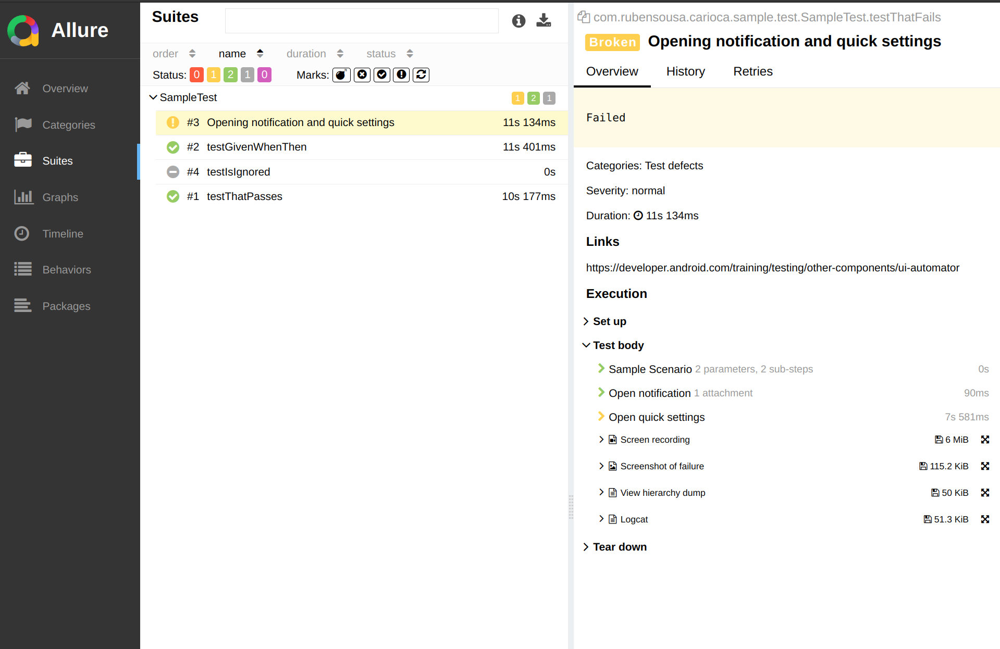

# Android Allure Plugin

This library comes with an [Allure](https://allurereport.org/) plugin that can be used to generate test reports based on
the metadata collected through each test execution.

## Setup

Add the plugin to your project:

```groovy
plugins {
    id 'com.rubensousa.carioca.report.allure' version '{{ allure_plugin.version }}'
}
```

## Generating reports

A test report is automatically generated when `connectedDebugAndroidTest` is executed if you're
using `InstrumentedReportRule` from [here](test-reports-android.md)

After each test execution, the plugin will generate the allure results
at:

```
build/output/allure-results
```

Then just run `allure serve` or `allure generate` to generate the reports and you should see something like this:



The following attachments are included out of the box for every failure:

1. Screen recording
2. Screenshot immediately after failure
3. View hierarchy dump
4. Logcat during test execution

## Configuration options

To customize the plugin use the following:

```kotlin
allureReport {
    /**
     * The name of the test task that will be invoked
     * to generate the report on `connectedAllureReport`
     */
    testTask = "connectedDebugAndroidTest"
    /**
     * By default, logcat files are not included if the test passes
     */
    keepLogcatOnSuccess = false
    /**
     * The report output path.
     * Can be used to merge reports of multiple modules by using the same directory
     * Null means `built/outputs/allure-results` is used
     */
    outputDir = null
}
```

## Multi-module results

You can aggregate all test reports by defining the `outputDir` option for the plugin.
Place this in your root project `build.gradle` file:

```kotlin

subprojects {
    /**
     * Move all allure-results to the same directory,
     * so that all tests from the project are seen in a single report
     */
    plugins.withId("com.rubensousa.carioca.report.allure") {
        extensions.getByType(AllureReportExtension::class).apply {
            outputDir = rootProject.file("build/outputs/allure-results")
        }
    }
}
```

This will move all test reports of all modules with the plugin to the same `build/outputs/allure-results` in your root
project

## Sample

The [sample project](https://github.com/rubensousa/Carioca/tree/main/sample) in the official repository contains a few
examples for some reports